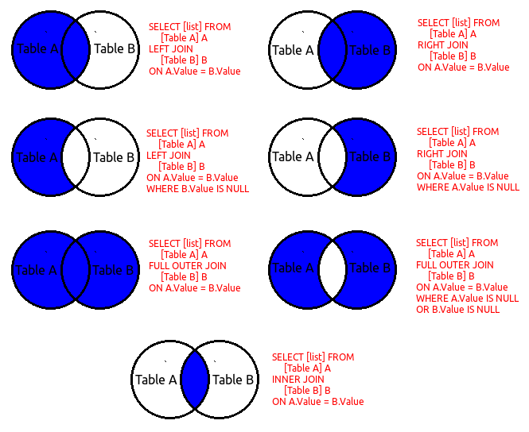

##### INNER JOIN
```sql
SELECT *
FROM sandbox.orders AS o

INNER JOIN sandbox.customers AS c
ON c.id = o.customer_id
;
```

<table caption="orders (3 rows)">
    <thead>
        <tr>
            <th class="col1">id</th>
            <th class="col2">customer_id</th>
            <th class="col3">product</th>
            <th class="col4">order_date</th>
            <th class="col5">id</th>
            <th class="col6">name</th>
            <th class="col7">email</th>
        </tr>
    </thead>
    <tbody>
        <tr>
            <td class="col1">1</td>
            <td class="col2">1</td>
            <td class="col3">e5e7cbcfd2</td>
            <td class="col4">2025-05-15</td>
            <td class="col5">1</td>
            <td class="col6">48cf5</td>
            <td class="col7">574f3@6b706.com</td>
        </tr>
        <tr>
            <td class="col1">2</td>
            <td class="col2">2</td>
            <td class="col3">e5e7cbcfd2</td>
            <td class="col4">2025-05-15</td>
            <td class="col5">2</td>
            <td class="col6">1746b</td>
            <td class="col7">118c6@e2dba.com</td>
        </tr>
        <tr>
            <td class="col1">3</td>
            <td class="col2">3</td>
            <td class="col3">e5e7cbcfd2</td>
            <td class="col4">2025-05-15</td>
            <td class="col5">3</td>
            <td class="col6">9ea07</td>
            <td class="col7">638dd@d00d3.com</td>
        </tr>
    </tbody>
</table>

> Fetching all orders with an associated customer, excluding rows from either table where no matches exist.

<br />

##### LEFT JOIN
```sql
SELECT *
FROM sandbox.customers AS c

LEFT JOIN sandbox.orders AS o
ON o.customer_id = c.id
;
```

<table caption="customers (10 rows)">
    <thead>
        <tr>
            <th class="col1">id</th>
            <th class="col2">name</th>
            <th class="col3">email</th>
            <th class="col4">id</th>
            <th class="col5">customer_id</th>
            <th class="col6">product</th>
            <th class="col7">order_date</th>
        </tr>
    </thead>
    <tbody>
        <tr>
            <td class="col1">1</td>
            <td class="col2">48cf5</td>
            <td class="col3">574f3@6b706.com</td>
            <td class="col4">1</td>
            <td class="col5">1</td>
            <td class="col6">e5e7cbcfd2</td>
            <td class="col7">2025-05-15</td>
        </tr>
        <tr>
            <td class="col1">2</td>
            <td class="col2">1746b</td>
            <td class="col3">118c6@e2dba.com</td>
            <td class="col4">2</td>
            <td class="col5">2</td>
            <td class="col6">e5e7cbcfd2</td>
            <td class="col7">2025-05-15</td>
        </tr>
        <tr>
            <td class="col1">3</td>
            <td class="col2">9ea07</td>
            <td class="col3">638dd@d00d3.com</td>
            <td class="col4">3</td>
            <td class="col5">3</td>
            <td class="col6">e5e7cbcfd2</td>
            <td class="col7">2025-05-15</td>
        </tr>
        <tr>
            <td class="col1">4</td>
            <td class="col2">6ab19</td>
            <td class="col3">50d88@7453d.com</td>
            <td class="col4"></td>
            <td class="col5"></td>
            <td class="col6"></td>
            <td class="col7"></td>
        </tr>
        <tr>
            <td class="col1">5</td>
            <td class="col2">093cf</td>
            <td class="col3">d5b59@1dece.com</td>
            <td class="col4"></td>
            <td class="col5"></td>
            <td class="col6"></td>
            <td class="col7"></td>
        </tr>
        <tr>
            <td class="col1">6</td>
            <td class="col2">79ffe</td>
            <td class="col3">2f341@98516.com</td>
            <td class="col4"></td>
            <td class="col5"></td>
            <td class="col6"></td>
            <td class="col7"></td>
        </tr>
        <tr>
            <td class="col1">7</td>
            <td class="col2">7649b</td>
            <td class="col3">f799f@d2624.com</td>
            <td class="col4"></td>
            <td class="col5"></td>
            <td class="col6"></td>
            <td class="col7"></td>
        </tr>
        <tr>
            <td class="col1">8</td>
            <td class="col2">fe5ec</td>
            <td class="col3">cca89@53dc0.com</td>
            <td class="col4"></td>
            <td class="col5"></td>
            <td class="col6"></td>
            <td class="col7"></td>
        </tr>
        <tr>
            <td class="col1">9</td>
            <td class="col2">ba813</td>
            <td class="col3">eef72@f045a.com</td>
            <td class="col4"></td>
            <td class="col5"></td>
            <td class="col6"></td>
            <td class="col7"></td>
        </tr>
        <tr>
            <td class="col1">10</td>
            <td class="col2">7e7b6</td>
            <td class="col3">c5c26@249d4.com</td>
            <td class="col4"></td>
            <td class="col5"></td>
            <td class="col6"></td>
            <td class="col7"></td>
        </tr>
    </tbody>
</table>

> Retrieves all customers, even if they did not place an order.

<br />

##### LEFT OUTER JOIN
```sql
SELECT *
FROM sandbox.customers AS c

LEFT JOIN sandbox.orders AS o
ON o.customer_id = c.id

WHERE o.customer_id IS NULL
;
```
<table caption="customers (7 rows)">
    <thead>
        <tr>
            <th class="col1">id</th>
            <th class="col2">name</th>
            <th class="col3">email</th>
            <th class="col4">id</th>
            <th class="col5">customer_id</th>
            <th class="col6">product</th>
            <th class="col7">order_date</th>
        </tr>
    </thead>
    <tbody>
        <tr>
            <td class="col1">4</td>
            <td class="col2">6ab19</td>
            <td class="col3">50d88@7453d.com</td>
            <td class="col4"></td>
            <td class="col5"></td>
            <td class="col6"></td>
            <td class="col7"></td>
        </tr>
        <tr>
            <td class="col1">5</td>
            <td class="col2">093cf</td>
            <td class="col3">d5b59@1dece.com</td>
            <td class="col4"></td>
            <td class="col5"></td>
            <td class="col6"></td>
            <td class="col7"></td>
        </tr>
        <tr>
            <td class="col1">6</td>
            <td class="col2">79ffe</td>
            <td class="col3">2f341@98516.com</td>
            <td class="col4"></td>
            <td class="col5"></td>
            <td class="col6"></td>
            <td class="col7"></td>
        </tr>
        <tr>
            <td class="col1">7</td>
            <td class="col2">7649b</td>
            <td class="col3">f799f@d2624.com</td>
            <td class="col4"></td>
            <td class="col5"></td>
            <td class="col6"></td>
            <td class="col7"></td>
        </tr>
        <tr>
            <td class="col1">8</td>
            <td class="col2">fe5ec</td>
            <td class="col3">cca89@53dc0.com</td>
            <td class="col4"></td>
            <td class="col5"></td>
            <td class="col6"></td>
            <td class="col7"></td>
        </tr>
        <tr>
            <td class="col1">9</td>
            <td class="col2">ba813</td>
            <td class="col3">eef72@f045a.com</td>
            <td class="col4"></td>
            <td class="col5"></td>
            <td class="col6"></td>
            <td class="col7"></td>
        </tr>
        <tr>
            <td class="col1">10</td>
            <td class="col2">7e7b6</td>
            <td class="col3">c5c26@249d4.com</td>
            <td class="col4"></td>
            <td class="col5"></td>
            <td class="col6"></td>
            <td class="col7"></td>
        </tr>
    </tbody>
</table>

> Retrieves all customers, only if they did not place an order.

<br />

##### RIGHT JOIN
```sql
SELECT *
FROM sandbox.customers AS c

RIGHT JOIN sandbox.orders AS o
ON o.customer_id = c.id
;
```

<table caption="customers (4 rows)">
    <thead>
        <tr>
            <th class="col1">id</th>
            <th class="col2">name</th>
            <th class="col3">email</th>
            <th class="col4">id</th>
            <th class="col5">customer_id</th>
            <th class="col6">product</th>
            <th class="col7">order_date</th>
        </tr>
    </thead>
    <tbody>
        <tr>
            <td class="col1">1</td>
            <td class="col2">48cf5</td>
            <td class="col3">574f3@6b706.com</td>
            <td class="col4">1</td>
            <td class="col5">1</td>
            <td class="col6">49dcc5e912</td>
            <td class="col7">2025-05-15</td>
        </tr>
        <tr>
            <td class="col1">2</td>
            <td class="col2">1746b</td>
            <td class="col3">118c6@e2dba.com</td>
            <td class="col4">2</td>
            <td class="col5">2</td>
            <td class="col6">7ec76ce3c9</td>
            <td class="col7">2025-05-15</td>
        </tr>
        <tr>
            <td class="col1">3</td>
            <td class="col2">9ea07</td>
            <td class="col3">638dd@d00d3.com</td>
            <td class="col4">3</td>
            <td class="col5">3</td>
            <td class="col6">902688e1e4</td>
            <td class="col7">2025-05-15</td>
        </tr>
        <tr>
            <td class="col1"></td>
            <td class="col2"></td>
            <td class="col3"></td>
            <td class="col4">4</td>
            <td class="col5"></td>
            <td class="col6">2a649e9b89</td>
            <td class="col7">2025-05-15</td>
        </tr>
    </tbody>
</table>

> Retrieves all orders, even if they are not associated to a customer.

<br />

##### RIGHT OUTER JOIN
```sql
SELECT *
FROM sandbox.customers AS c

RIGHT JOIN sandbox.orders AS o
ON o.customer_id = c.id

WHERE c.id IS NULL
;
```

> Retrieves all orders, only if they are not associated to a customer.

<br />

##### FULL JOIN
> **ATTENTION**
> "FULL JOIN" is not supported in MySQL.
>
> Supported databases inclued: PostgreSQL, Microsoft SQL Server, Oracle, Snowflake, and IBM Db2.

We must emulate a FULL JOIN in MySQL.
```sql
SELECT
c.id AS customer_id,
c.`name`,
o.id AS order_id,
o.product
FROM sandbox.customers AS c

LEFT JOIN sandbox.orders AS o
ON o.customer_id = c.id

UNION

SELECT
c.id AS customer_id,
c.`name`,
o.id AS order_id,
o.product
FROM sandbox.customers AS c

RIGHT JOIN sandbox.orders AS o
ON o.customer_id = c.id
;
```
<table caption="customers (11 rows)">
    <thead>
        <tr>
            <th class="col1">customer_id</th>
            <th class="col2">name</th>
            <th class="col3">order_id</th>
            <th class="col4">product</th>
        </tr>
    </thead>
    <tbody>
        <tr>
            <td class="col1">1</td>
            <td class="col2">48cf5</td>
            <td class="col3">1</td>
            <td class="col4">49dcc5e912</td>
        </tr>
        <tr>
            <td class="col1">2</td>
            <td class="col2">1746b</td>
            <td class="col3">2</td>
            <td class="col4">7ec76ce3c9</td>
        </tr>
        <tr>
            <td class="col1">3</td>
            <td class="col2">9ea07</td>
            <td class="col3">3</td>
            <td class="col4">902688e1e4</td>
        </tr>
        <tr>
            <td class="col1">4</td>
            <td class="col2">6ab19</td>
            <td class="col3"></td>
            <td class="col4"></td>
        </tr>
        <tr>
            <td class="col1">5</td>
            <td class="col2">093cf</td>
            <td class="col3"></td>
            <td class="col4"></td>
        </tr>
        <tr>
            <td class="col1">6</td>
            <td class="col2">79ffe</td>
            <td class="col3"></td>
            <td class="col4"></td>
        </tr>
        <tr>
            <td class="col1">7</td>
            <td class="col2">7649b</td>
            <td class="col3"></td>
            <td class="col4"></td>
        </tr>
        <tr>
            <td class="col1">8</td>
            <td class="col2">fe5ec</td>
            <td class="col3"></td>
            <td class="col4"></td>
        </tr>
        <tr>
            <td class="col1">9</td>
            <td class="col2">ba813</td>
            <td class="col3"></td>
            <td class="col4"></td>
        </tr>
        <tr>
            <td class="col1">10</td>
            <td class="col2">7e7b6</td>
            <td class="col3"></td>
            <td class="col4"></td>
        </tr>
        <tr>
            <td class="col1"></td>
            <td class="col2"></td>
            <td class="col3">4</td>
            <td class="col4">2a649e9b89</td>
        </tr>
    </tbody>
</table>

The above returns all unique rows from both tables, matched or not. Filling in NULLs when there's no match.
- LEFT JOIN gives us all customers, including those without orders.
- RIGHT JOIN gives us all orders, including those with no matching customer.
- UNION combines both result sets, effectively simulating a FULL JOIN.

> **NOTE**
> UNION will remove duplicates.
>
> Using UNION ALL we can prevent duplicates being removed, thus giving us all records.

<br />

##### FULL OUTER JOIN
> *ATTENTION*
> "FULL OUTER JOIN" is not supported in MySQL.
> Supported databases inclued: PostgreSQL, Microsoft SQL Server, Oracle, Snowflake, and IBM Db2.

```sql

SELECT
c.id AS customer_id,
c.`name`,
o.id AS order_id,
o.product
FROM sandbox.customers AS c

LEFT JOIN sandbox.orders AS o
ON o.customer_id = c.id

WHERE o.customer_id IS NULL

UNION

SELECT
c.id AS customer_id,
c.`name`,
o.id AS order_id,
o.product
FROM sandbox.customers AS c

RIGHT JOIN sandbox.orders AS o
ON o.customer_id = c.id

WHERE c.id IS NULL
;
```
<table caption="customers (8 rows)">
    <thead>
        <tr>
            <th class="col1">customer_id</th>
            <th class="col2">name</th>
            <th class="col3">order_id</th>
            <th class="col4">product</th>
        </tr>
    </thead>
    <tbody>
        <tr>
            <td class="col1">4</td>
            <td class="col2">6ab19</td>
            <td class="col3"></td>
            <td class="col4"></td>
        </tr>
        <tr>
            <td class="col1">5</td>
            <td class="col2">093cf</td>
            <td class="col3"></td>
            <td class="col4"></td>
        </tr>
        <tr>
            <td class="col1">6</td>
            <td class="col2">79ffe</td>
            <td class="col3"></td>
            <td class="col4"></td>
        </tr>
        <tr>
            <td class="col1">7</td>
            <td class="col2">7649b</td>
            <td class="col3"></td>
            <td class="col4"></td>
        </tr>
        <tr>
            <td class="col1">8</td>
            <td class="col2">fe5ec</td>
            <td class="col3"></td>
            <td class="col4"></td>
        </tr>
        <tr>
            <td class="col1">9</td>
            <td class="col2">ba813</td>
            <td class="col3"></td>
            <td class="col4"></td>
        </tr>
        <tr>
            <td class="col1">10</td>
            <td class="col2">7e7b6</td>
            <td class="col3"></td>
            <td class="col4"></td>
        </tr>
        <tr>
            <td class="col1"></td>
            <td class="col2"></td>
            <td class="col3">4</td>
            <td class="col4">2a649e9b89</td>
        </tr>
    </tbody>
</table>

> The above returns all unique rows from both tables where there is no match.

<br />

##### SELF JOIN
```sql
SELECT
a.`name` AS employee,
b.`name` AS manager
FROM sandbox.employees AS a

JOIN sandbox.employees AS b
ON b.id = a.manager_id
;
```

<table caption="employees (3 rows)">
    <thead>
        <tr>
            <th class="col1">employee</th>
            <th class="col2">manager</th>
        </tr>
    </thead>
    <tbody>
        <tr>
            <td class="col1">3cf6d</td>
            <td class="col2">83949</td>
        </tr>
        <tr>
            <td class="col1">b89a0</td>
            <td class="col2">83949</td>
        </tr>
        <tr>
            <td class="col1">6db09</td>
            <td class="col2">83949</td>
        </tr>
    </tbody>
</table>

> Returns all records where an employee has a manager.

<br />
